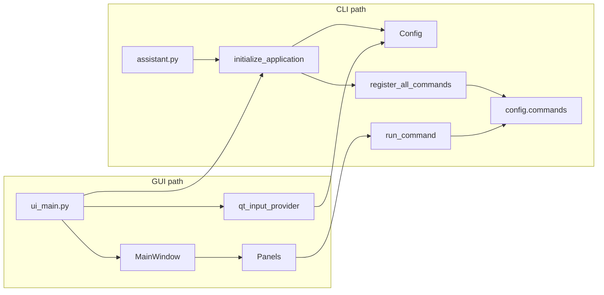

# PROJECT_MAP.md — Project Ceres (AI reference)

This document is for **coding agents**: it describes the **current** repository layout, naming patterns, and how components connect. It does **not** track roadmap or planned work (see `ROADMAP.md` at repo root for human planning only). End-user setup and feature marketing copy live in `README.md`.

**Scope:** onboarding map — not a command manual, not a schema dump. **Known:** registry of command names = `register_all_commands` in [`assistant.py`](assistant.py); **`Config` fields** = [`core/config.py`](core/config.py). Deeper reading: `pantheon/*/README.md`, [`README.md`](README.md), cited modules.

---

## 1. Entry points and bootstrap

| Entry | File | Role |
|-------|------|------|
| GUI | `ui_main.py` | Launches Qt; redirects stdout/stderr to `logs/ui.log`; re-enters `.venv` when `python ui_main.py` is launched with another interpreter; ensures project root on `sys.path`; calls backend init from `assistant.py`; sets `config.input_provider` to `qt_input_provider` (`ui/input_bridge.py`); registers commands; opens `MainWindow`. See `docs/gui_launch.md`. |
| CLI | `assistant.py` | Terminal REPL (`prompt_toolkit`); same `initialize_application()`, `register_all_commands()`, `run_command()`; uses terminal-friendly `input_provider` unless overridden. |

Shared backend (both entry points):

- `initialize_application()` — builds `Config`, loads settings, GPT client, scheduler, history, etc.
- `register_all_commands(config, ...)` — populates `config.commands` with `(handler, help)` tuples.
- `run_command(name, args, config, ...)` — dispatches to the registered handler (CLI and panels call this).

---

## 2. Configuration and runtime files (not source)

| Artifact | Purpose |
|----------|---------|
| `core/config.py` | **`Config` dataclass** — single source of truth for vaults, command registry, paths, feature flags. **Not** a shim. Import as `from core.config import Config`. |
| `variables.env` | Secrets (`OPENAI_API_KEY`, Discord, Spotify, etc.). **Never commit.** Loaded via `python-dotenv` (and GUI Preferences can push into `os.environ`). |
| `settings.json` | Persisted GUI/CLI settings (gitignored). `Config.load_settings()` / `save_settings()` — e.g. current vault, FGU roots, model name, `openai_key` handling (key often from env only). |
| `vaults.json` | Vault name → path map (gitignored). |
| `.tidal_token.json`, `.youtube_token.json` | OAuth tokens created by panels after sign-in (typically gitignored). |
| `logs/ui.log` | GUI run log (`ui_main.py` redirects stdio here each launch). |
| `logs/errors.log` | Rotating error log from `core/errors.py` (`install_error_handler`, `guarded_main`). |
| `exports/` | Runtime outputs (gitignored per project conventions). |
| `QSettings` org `ProjectCeres` / app `GMAssistant` | Window geometry and dock state (`ui/main_window.py`). |

---

## 3. Top-level directory map

| Path | Role |
|------|------|
| `pantheon/` | **All new implementation code** — twelve named domains (see §4). |
| `core/` | `config.py` is canonical; other modules are a mix of thin Pantheon shims, CLI-oriented implementations, and infrastructure (see §5). |
| `ui/` | PyQt5/PySide6 GUI: `main_window.py`, `theme.py`, `input_bridge.py`, `panels/`, `dialogs/`, `assets/`. |
| `automation/` | Backward-compat package re-exporting `pantheon.serritor` (`Job`, `Scheduler`, `register_default_jobs`). |
| `pdf_tools/` | Backward-compat package re-exporting `pantheon.imporcitor.pdf_tools`. |
| `helpers/discord_bot/` | JSON schemas, preview scripts — not the in-app Discord panel. |
| `tools/scripts/` | Offline maintenance (e.g. SRD chunk/convert scripts, YAML rules). |
| `GMAssistantVault/` | Default/sample Obsidian vault tree bundled in the repo. |
| `.cursor/rules/` | Cursor agent rules (normative coding workflow — cite these, do not duplicate wholesale here). |

---

## 4. Pantheon domains (12)

Implementations belong under `pantheon/<domain>/`. The conceptual names map to Roman agricultural “helper gods of Ceres”; see `pantheon/PANTHEON.md` for flavor text. **Current rule:** new code goes here, not into `core/` (except `core/config.py` and unavoidable CLI glue).

| Domain | Path | Owns |
|--------|------|------|
| Vervactor | `pantheon/vervactor/` | Campaign creation, vault folder setup |
| Reparator | `pantheon/reparator/` | Template system |
| Imporcitor | `pantheon/imporcitor/` | PDF→markdown, bulk import (`pdf_core.py`, `pdf_tools/`) |
| Insitor | `pantheon/insitor/` | Note creation (`NoteSpec`, `create_note()`, …) |
| Obarator | `pantheon/obarator/` | Tags and YAML frontmatter |
| Occator | `pantheon/occator/` | Vault search index, SRD indexing/search |
| Serritor | `pantheon/serritor/` | Background jobs, task scheduler |
| Subruncinator | `pantheon/subruncinator/` | Cache/cleanup maintenance |
| Messor | `pantheon/messor/` | FGU logs, audio transcription |
| Convector | `pantheon/convector/` | Wake words, voice/NLP pipeline, transcript parsing, session JSON packages, Ceres Chat agent |
| Conditor | `pantheon/conditor/` | Note history/versioning, backups |
| Promitor | `pantheon/promitor/` | Session scheduling, `.ics`, Discord poll packages |

### Key entry files (by domain)

| Area | Files |
|------|--------|
| Convector | `wake_words.py`, `voice_commands.py`, `voice_pipeline.py`, `text_command_parser.py`, `transcript_parser.py`, `session_package.py`, `chat_agent.py` |
| Messor | `fgu_character.py`, `fgu.py`, `fgu_import.py`, `fgu_export.py`, `audio_session.py` |
| Insitor | `note_creator.py` |
| Occator | `search_index.py`, `srd_index.py` |
| Promitor | `session_scheduler.py`, exports used by `assistant.py` for session packages |
| Serritor | `job.py`, `jobs.py`, `task_scheduler.py` |

**Wake words:** `WAKE_WORDS = ("veras", "chroma")` in `pantheon/convector/wake_words.py`. Persona / response pools: `ui/panels/discord_panel.py`.

---

## 5. `core/` module classification

### 5.1 Canonical

| Module | Notes |
|--------|--------|
| `config.py` | `Config` dataclass; `load_settings` / `save_settings`; all panels receive this via constructor. |

### 5.2 Infrastructure / CLI logic (not thin re-exports)

| Module | Notes |
|--------|--------|
| `vaults.py` | Vault CRUD, Obsidian sync, numbered vault UI helpers — **implemented in core**. |
| `gpt.py` | `GPTClient`, GPT command helpers — **implemented in core** (OpenAI client wrapper). |
| `errors.py` | Global exception hook, rotating `logs/errors.log` — **implemented in core**. |
| `voice_commands.py` | Lightweight `ParsedCommand` / `parse_spoken_command` regex bridge — **legacy CLI-oriented**; richer pipeline lives in `pantheon/convector`. |

### 5.3 Hybrid

| Module | Notes |
|--------|--------|
| `notes.py` | Imports `NoteSpec` / `create_note` from `pantheon.insitor`; also implements CLI commands (`cmd_read`, `cmd_list`, `cmd_createnote`, …) with filesystem I/O. |

### 5.4 Thin shims (re-export Pantheon)

| `core/` module | Points to |
|----------------|-----------|
| `campaigns.py` | `pantheon.vervactor.campaigns` |
| `templates.py` | `pantheon.reparator.templates` |
| `pdf.py` | `pantheon.imporcitor.pdf_core` |
| `tags.py` | `pantheon.obarator.tags` |
| `search_index.py` | `pantheon.occator.search_index` |
| `srd_index.py` | `pantheon.occator.srd_index` |
| `scheduler.py` | `pantheon.serritor` |
| `history.py` | `pantheon.conditor.history` |
| `session_scheduler.py` | `pantheon.promitor.session_scheduler` |
| `fgu_integration.py` | `pantheon.messor.fgu` |
| `audio.py` | `pantheon.messor.audio_session` (e.g. `transcribe_audio`) |

### 5.5 Shim packages (repo root)

| Package | Canonical location |
|---------|---------------------|
| `automation/job.py` | `pantheon/serritor/job.py` |
| `automation/task_scheduler.py` | `pantheon/serritor/task_scheduler.py` |
| `automation/jobs.py` | Re-exports job registry from serritor |
| `pdf_tools/*` | `pantheon/imporcitor/pdf_tools/*` |

`core/__init__.py` may be empty; do not assume package-level exports from `core`.

---

## 6. UI organization

### 6.1 Pattern

- **Dock widgets:** Most features are `QDockWidget` subclasses in `ui/panels/`.
- **Imports:** Every UI file uses the **PyQt5 first, PySide6 fallback** try/except pattern (see `.cursor/rules/001-code-standards.mdc`).
- **Theme:** `ui/theme.py` exposes colors and `STYLESHEET` used by `MainWindow` and panels.
- **Dependency injection:** Most panels take `(config, run_command, parent)`. Exceptions in `MainWindow`: `SoundboardPanel(parent)` and `MixerPanel(parent)` only; `BrowserPanel(config, parent)` has no `run_command`.
- **Threading:** Long work in `QThread`/`QObject` workers; results return via **signals** only; never touch Qt widgets from background threads.
- **Cross-panel behavior:** Prefer connections via **`MainWindow`** (signals/slots, shared `run_command`) over importing one panel module from another.

### 6.2 Central vs docked layout

- **Central widget:** minimal dark placeholder. Ceres Chat is dockable, not central.
- **Left dock:** `Ceres Chat`, `VaultNotesPanel`, `MixerPanel`, `EqualizerPanel` (default order established in `MainWindow._build_panels`).
- **Bottom dock:** `ConsolePanel` (hidden by default if `config.console_hidden_default`).
- **Right dock (tabbed stack):** Discord, Spotify, Soundboard, Fantasy Grounds, Scheduler, Browser, Syrinscape, YouTube, Tidal, Local Music, Now Playing, Visualiser, Plex / Jellyfin, Master Scenes.

### 6.3 Panel inventory (`ui/panels/`)

| File | Purpose |
|------|---------|
| `chat_panel.py` | Ceres Chat; NLP agent; command dispatch; status/console requests. |
| `vault_notes_panel.py` | Obsidian vault browser, note CRUD, opens notes. |
| `console_panel.py` | Scrollable log of raw command output (power users). |
| `discord_panel.py` | Discord bot, voice, transcription, wake-word personas; emits music/service commands. |
| `spotify_panel.py` | Spotify OAuth, playback, search, scenes. |
| `soundboard_panel.py` | Multi-channel pygame soundboard + scenes. |
| `fgu_panel.py` | FGU XML/campaign browsing. |
| `scheduler_panel.py` | Session scheduling, `.ics`, Discord poll integration. |
| `browser_panel.py` | Embedded web view, bookmarks, Obsidian clip. |
| `syrinscape_panel.py` | Syrinscape REST, moods/soundsets, scenes. |
| `youtube_panel.py` | yt-dlp + API search, OAuth playlists, scenes. |
| `tidal_panel.py` | tidalapi OAuth, playback, scenes. |
| `local_music_panel.py` | Local folder library, queue, scenes. |
| `now_playing_panel.py` | Unified current-track/status view for registered media panels. |
| `equalizer_panel.py` | 10-band EQ controls and presets for supported local audio panels. |
| `visualiser_panel.py` | Audio visualiser dock; NumPy is optional. |
| `plex_jellyfin_panel.py` | Plex / Jellyfin playback, search, scenes, and Now Playing integration. |
| `master_scene_panel.py` | Cross-service scene launcher that can fan out commands to media panels. |
| `mixer_panel.py` | Per-source volume/mute for registered audio panels. |

### 6.4 Dialogs and assets

- `ui/dialogs/preferences_dialog.py` — Settings UI; saving may update `config` and emit signals (e.g. main window refreshes chat client on API key change).
- `ui/assets/*.png` — Tab icons (`MainWindow._TAB_ICONS`) and mixer source icons (filenames passed to `MixerPanel.register_source`).

### 6.5 Signal wiring (main window)

Wiring is **declared in** [`ui/main_window.py`](ui/main_window.py) (`_build_panels` and nearby). In short:

- **Discord → music/apps:** `*_command` signals on `DiscordPanel` connect to `handle_command` on Spotify, Syrinscape, YouTube, Tidal, Local Music, Plex / Jellyfin, and Master Scenes.
- **Scheduler ↔ Discord:** `SchedulerPanel` requests channels, sends/closes polls, posts messages; `DiscordPanel` signals poll results and errors back (see panel files for exact signal names).
- **Mixer:** `MixerPanel.register_source(...)` after audio panels exist; currently includes Soundboard, Syrinscape, Spotify, YouTube, Tidal, Local Music, and Plex / Jellyfin.
- **Now Playing:** `NowPlayingPanel.register_source(...)` polls registered media panels for track/status metadata.
- **Equalizer:** `EqualizerPanel.eq_changed` connects to supported local audio panels (`SoundboardPanel`, `LocalMusicPanel`).
- **Status:** many panels emit `status_message` → main window status bar; `ChatPanel` can request the console for full command output.

**Design note:** Spotify quick-controls for Discord text commands stay **in `discord_panel.py`** (not the Spotify panel).

---

## 7. Naming conventions (current)

| Kind | Convention |
|------|----------------|
| Python modules | `snake_case.py` |
| Pantheon subpackages | lowercase domain folder names |
| Panel classes | `SomethingPanel` (`QDockWidget` subclasses) |
| Qt signals | `snake_case` descriptive (`status_message`, `spotify_command`, …) |
| Private methods | Leading `_underscore` |
| Config fields | `snake_case` on `Config`; new persisted fields added to `load_settings` / `save_settings` as needed |

---

## 8. Agent rules distilled (operational)

These summarize enforced project rules; full detail is in `.cursor/rules/*.mdc`.

1. **New implementation code** → `pantheon/<domain>/`. Do not add new logic under `core/` except `core/config.py` (and minimal CLI glue where already established).
2. **No global app singletons** — pass `Config` and callables through constructors.
3. **Secrets** — only `variables.env` / environment (never hardcode keys in source).
4. **Import direction** — `pantheon` must not import `ui`.
5. **Qt thread safety** — UI updates on the main thread; workers signal results.
6. **PyQt import guard** — try PyQt5, except PySide6 (see `001-code-standards.mdc`).
7. **Panel ownership** — do not move controls between panels unless explicitly instructed (see `000-project-context.mdc`).
8. **Verification** — after edits, follow `04-verification.mdc` (`py_compile`, grep for dropped `def`, check file tails). Session handoffs use `05-handoff.mdc` format when completing `CURSOR_BRIEF.md` tasks.

---

## 9. Command registry reference

**Mechanics:** `assistant.register_all_commands()` fills `config.commands: Dict[str, Tuple[Callable, str]]`. `assistant.run_command(command_name, args, config)` lowercases `command_name` and invokes the handler with a **single string** `args` (empty string if none). **No alias map** — only case-insensitivity via `.lower()`.

**GUI note:** `MainWindow._refresh_vaults` refreshes Obsidian vaults directly through `core.vaults.sync_obsidian_vaults`; there is still no CLI `sync-obsidian` command registered.

**Side-effect shorthand (when reading handlers):** vault = disk under vault roots; `settings` / `vaults.json` = persisted JSON; **net** = OpenAI or HTTP; **jobs** = scheduler / serritor jobs; **exports** = `exports/` tree.

### 9.1 Commands by category (not exhaustive)

| Category | Representative commands | Typical modules |
|----------|---------------------------|-----------------|
| Meta / shell | `help`, `exit`, `reset`, `debug`, `showignored` | `assistant.py` |
| Vaults & notes | `addvault`, `switch`, `vaults`, `read`, `list`, `tree`, `createnote`, `send` | `core.vaults`, `core.notes`, `pantheon.insitor` |
| Templates | `showtemplates`, `createtemplate`, `deletetemplate`, `uploadtemplate`, … | `pantheon.reparator` |
| GPT | `gptwrite`, `editnote` | `core.gpt` |
| Search / SRD | `search`, `index`, `srd-index`, `search-srd` | `pantheon.occator` |
| PDF | `pdf2md`, `pdfbatch`, `pdf-send-to-vault` | `assistant.py`, `pantheon.imporcitor` |
| Sessions & exports | `session-schedule`, `session-discord-export` | `pantheon.promitor`, `pantheon.convector` |
| Scheduler | `schedule-start`, `schedule-stop`, `schedule-status`, `schedule-run-once`, `*-run-now` variants | `pantheon.serritor`, `assistant.py` |
| Campaigns & FGU | `campaign-create`, `session-create`, `fgu-import-log`, … | `pantheon.vervactor`, `pantheon.messor`, `assistant.py` |
| Voice / inbox | `voice-command`, `voice-commands-from-*`, `voice-commands-process`, `voice-enable`, … | `pantheon.convector`, `assistant.py` |
| Tags & history | `tag-*`, `undo`, `history-list`, `history-restore` | `pantheon.obarator`, `pantheon.conditor` |

**Full list:** `register_all_commands` in [`assistant.py`](assistant.py) — no separate command reference document in this repo.

---

## 10. Config field reference

All attributes live on **`core.config.Config`** — see [`core/config.py`](core/config.py) for defaults and types. At runtime, `config.register_command(name, func, help)` fills **`commands`** during `register_all_commands` (shared by CLI and GUI).

**Persistence:**

| Storage | What goes there | Notes |
|---------|-----------------|-------|
| `settings.json` | `current_vault`, `ignored_vaults`, `default_model`, template URLs/paths, FGU roots, service config (`spotify_*`, `tidal_*`, `youtube_*`, `plex_jellyfin_*`), EQ config (`eq_enabled`, `eq_preset`, `eq_bands`), `voice_commands_enabled`, `console_hidden_default`, `soundboard_folders`, optional `openai_key` key, … | **`openai_key` is not required to be saved** (often from env only). |
| `vaults.json` | `vaults` map | Loaded/saved via `load_vaults` / `save_vaults` in startup flow. |
| Neither | `commands`, `vault_number_map`, `input_provider`, `env_file` | Ephemeral or set at bootstrap. |

**Inference:** which keys are loaded/saved may change — always check `Config.load_settings` / `save_settings` in [`core/config.py`](core/config.py) when adding a field.

---

## 11. Common workflow traces

Short **happy paths** — read cited files for edge cases.

1. **Boot (GUI)** — `ui_main` → `initialize_application` → `register_all_commands` → `MainWindow` + panels with `config` + `run_command`.
2. **Boot (CLI)** — same init → `run_main_loop` parses `command args` → `config.commands[name](args)`.
3. **Chat / NLP** — `ChatPanel` + `pantheon.convector.chat_agent.ChatAgent` → `run_command` (same registry as CLI).
4. **Discord → panel control** — `DiscordPanel` signals → target panel `handle_command` (bypasses `run_command` unless the panel delegates).
5. **Voice inbox** — JSON in `inbox/voice_commands/` → `voice-commands-process` → `voice_processor` → vault / exports per command type.

---

## 12. Canonical API index (by Pantheon domain)

Import from **`pantheon.<domain>`** (`__init__.py`) when possible — exports are the stable public surface. **§4** lists domain ownership; this table names **typical first imports** only (not exhaustive).

| Domain | Start here |
|--------|------------|
| Vervactor | `create_campaign`, `create_session`, … |
| Reparator | `find_all_templates`, `cmd_createtemplate`, `sync_templates_from_remote` |
| Imporcitor | `convert_pdf_to_md` (`pdf_core` / `pdf_tools` as needed) |
| Insitor | `NoteSpec`, `create_note`, `safe_filename` |
| Obarator | `extract_frontmatter`, `add_tag`, `list_all_tags` |
| Occator | `build_search_index`, `cmd_search`, `build_srd_index` |
| Serritor | `Scheduler`, `register_default_jobs`, job functions in `jobs.py` |
| Subruncinator | `clean_cache` |
| Messor | `attach_fgu_log_to_session`, `transcribe_audio`, `FGUEntityParser`, `import_campaign_entities`, `export_entities_to_xml`, `read_fgu_notes_in_vault` |
| Convector | `VoiceCommand`, `write_session_event_json`, `process_all_voice_commands`, `ChatAgent` → `chat_agent.py` |
| Conditor | `HistoryManager`, `create_vault_backup` |
| Promitor | `schedule_next_session`, `create_ics_file`, `build_session_event_package_from_scheduler` |

**Config** remains `from core.config import Config`.

---

## 13. Legacy / safe-to-edit matrix

| Area | Extend | Wrap | Avoid |
|------|--------|------|--------|
| **Pantheon domain modules** | Add functions/classes alongside existing patterns; export in domain `__init__.py` | Thin `core/*.py` shim re-export **only** if CLI/import compat required | Putting **new** business logic only in `core/` (except `config`, `vaults`, `gpt`, `errors`, `notes` glue as already done) |
| **`assistant.py`** | New `register_command` entries calling Pantheon | New `cmd_*` delegating to pantheon | Huge handlers duplicated from pantheon — call domain APIs instead |
| **`core/config.py`** | New fields + `load_settings`/`save_settings` keys | — | Ad-hoc global state outside `Config` |
| **Thin `core` shims** | Re-export additional names from pantheon | — | Editing generated content inside shim files beyond imports |
| **`ui/panels/*`** | New signals, widgets, `handle_command` branches | — | Blocking calls on UI thread; importing `pantheon` is OK, importing **from other panels** creates coupling — use `MainWindow` signals |
| **`core/vaults.py`, `core/gpt.py`, `core/notes.py`** | Bugfixes, CLI UX | Move **new** features to pantheon over time | Copy-pasting pantheon logic here |
| **`core/voice_commands.py`** | Tweak regex parser | Prefer `pantheon/convector` for new voice features | Duplicating convector pipeline |
| **Discord quick-controls** | `discord_panel.py` shortcuts | — | Moving Spotify Discord shortcuts into `spotify_panel.py` without explicit instruction |

---

## 14. Artifact and schema contracts

Summary only. **Known:** full structures and validation live in the **producer/consumer modules** (and helpers such as `helpers/discord_bot/session_event_schema.json`), not in this map.

**Inference:** relative paths below assume **process CWD** is the project root; if the app is started from another directory, resolve paths accordingly.

| Artifact | Where / pattern | Contract (summary) | Producer → consumer |
|----------|-----------------|--------------------|----------------------|
| Voice inbox JSON | `inbox/voice_commands/*.json` → optional `processed/` | `VoiceCommandDict`: `type`, `session_id`, `note_path`, `timestamp` (ISO **string**), `text`, `payload` — see `voice_command_to_dict` | Writers → `voice_processor` |
| Session export | `exports/session_event.json` | Snake_case keys per `session_event_to_dict` in `session_package.py`; external schema `helpers/discord_bot/session_event_schema.json` | CLI export → Discord helper (external) |
| ICS | `exports/next_session.ics` (typical) | iCalendar file from `promitor.session_scheduler` | Promitor → mail / Discord package |
| Undo history | `.ceres_history/history_index.json` + backup files | Entries: `note_path`, `backup_path`, `timestamp` | `HistoryManager` ↔ `undo` / voice edits |
| Vault zip backup | `backups/<date>/vault-backup-*.zip` | Whole vault tree zip | Scheduler / `schedule-backup-run-now` |
| Vault search | In-memory list from `build_search_index`; optional `index.json` via `save_index` | Entries: `id`, `path`, `title`, `tags`, `system`, `type` | **`search`** rebuilds each call; **`index` command does not persist** unless you wire `save_index` |
| SRD index | `<vault>/.ceres_index/records.json` | Array of `{path, title, system, tags, summary, content_sample}` | `build_srd_index` → `search-srd` |
| Note metadata | Per `.md` file | YAML `---` frontmatter (`extract_frontmatter`); inline `#tags` | Obarator → Occator indexing |
| Media scene presets | `syrinscape_scenes.json`, `youtube_scenes.json`, `tidal_scenes.json`, `local_music_scenes.json`, `plex_jellyfin_scenes.json`, `master_scenes.json` | Panel-owned quick-launch slot definitions | Media panels / Master Scenes → GUI |

---

## 15. Common edit recipes

| Task | Primary files | Secondary / optional | Trap / don’t | Verify |
|------|----------------|----------------------|--------------|--------|
| **New CLI command** | `assistant.py`: `cmd_*` + `register_all_commands` | Pantheon domain if logic belongs there | Duplicating pantheon logic in `cmd_*` | `python -m py_compile assistant.py`; run `help`; exercise new command |
| **New persisted `Config` field** | `core/config.py`: dataclass + `load_settings` + `save_settings` | `ui/dialogs/preferences_dialog.py` if user-editable | Forgetting `save_settings` key or saving secrets | `py_compile core/config.py`; launch GUI, change pref, restart |
| **New Pantheon API** | `pantheon/<domain>/…`; export in domain `__init__.py` | Thin `core/<shim>.py` only if old imports must keep working | New domain logic only in `core/` | `py_compile` changed modules; import from `pantheon` in a one-liner REPL |
| **New panel** | `ui/panels/<name>_panel.py`; `ui/main_window.py` dock + signals | `ui/assets/*.png`, `theme.py` if new colors | Blocking I/O on UI thread; missing `toggleViewAction` in menus | `py_compile` panel + main_window; open GUI |
| **New scheduler job** | `pantheon/serritor/task_scheduler.py` (`register_*_job` helpers) or `register_job`; wire in `register_default_jobs` | `assistant.py` “run-*-now” command | Duplicate job name → `ValueError` | `schedule-status`; `schedule-run-once` or dedicated `*-run-now` |
| **New voice command type** | `VoiceCommandType` + `voice_processor.process_voice_command` | `text_command_parser` / Discord if new phrases | Orphan type with no processor branch | Enqueue JSON → `voice-commands-process` |
| **New tag/frontmatter helper** | `pantheon/obarator/tags.py` | `pantheon/occator/search_index.py` if index fields change | Breaking YAML parsing for existing vaults | Run `search` / `index` on a vault |
| **New export artifact** | Convector `write_*` or Promitor export path | `exports/` layout, document in README | Hardcoded secrets in output | Write file, validate JSON with external schema if applicable |

---

## 16. Verification and smoke-test checklist

**No automated test suite** in-repo (no `tests/`, no `pytest` layout) — rely on manual smoke + the checks in [`.cursor/rules/04-verification.mdc`](.cursor/rules/04-verification.mdc): `python -m py_compile <file.py>`, grep for dropped `def` on large files, read last 20 lines for truncation.

| Change type | Minimal extra check |
|-------------|---------------------|
| Any Python module | `py_compile` changed files |
| Pantheon / backend | `python -c "from pantheon.<domain> import …"` from project root |
| `assistant.py` / registry | Run CLI `help` or inspect `config.commands` after init |
| `Config` persistence | Confirm new field in `load_settings`/`save_settings` and **no secrets** written |
| GUI / panel | `python ui_main.py`; tail `logs/ui.log` for startup checkpoints, geometry state, and tracebacks |
| Scheduler | `schedule-status` or `schedule-run-once` / relevant `*-run-now` |
| Voice inbox | Drop a tiny valid JSON in `inbox/voice_commands/`, run `voice-commands-process` (use `--dry-run` if supported) |

---

## 17. Error-handling and reporting conventions

| Layer | Pattern |
|-------|---------|
| **CLI command handlers** | Predominantly **`print`** for user-visible errors; many handlers use an `error_func` (e.g. `error("no_vault", …)`) for standardized messages. **Do not raise** to the REPL for expected user mistakes — catch, print, return. OpenAI/API failures often caught with printed hints. |
| **`run_command`** | Unknown command → `error_func("unknown_command")`; **no exception** for missing name. |
| **`core/errors.py`** | `install_error_handler()` sets `sys.excepthook`, `threading.excepthook`, optional `unraisablehook` → **logs full trace** to `logs/errors.log` for unhandled exceptions; **KeyboardInterrupt** is not logged as crash. |
| **CLI entry** | `assistant.guarded_main` wraps `main()` so crashes are logged (see `errors.py`). |
| **GUI** | Panels emit **`status_message`** to `MainWindow` for transient errors; **QMessageBox** for About/Help; **no** automatic `errors.log` for caught slot exceptions — **catch in slots**, emit status or log. |
| **GUI stdout/stderr** | `ui_main.py` prints startup/failure status to the real terminal, then redirects stdio to **`logs/ui.log`** — prints from libraries may land there, not the terminal. |
| **Background workers** | Use **signals** for errors (`error` / `result_ready` pattern); never touch widgets from worker threads. |
| **Consistency** | Long-running CLI commands print progress; GUI should not rely on stdout — use signals or status bar. |

---

## 18. Subsystem maturity / stability (for agents)

Rough **risk / churn** guidance (not a quality judgment):

| Area | Stability | Agent takeaway |
|------|-----------|----------------|
| `Config`, vault paths, `settings.json` | High | Small edits; migrate fields carefully. |
| Pantheon domains (non-UI) | Medium–high | New work belongs here; keep exports in sync. |
| Thin `core` shims, `automation/`, `pdf_tools/` | Compat only | Re-export only; no new logic. |
| Ceres Chat / `ChatAgent` | Medium | OpenAI + dispatch; test after prompt/tool changes. |
| Voice + Discord + media panels | Medium | Many integrations; prefer signals, test smoke. |
| Scheduler (`pantheon/serritor`) | Medium–high | Small API; jobs must be thread-safe. |
| PDF pipeline | Medium | Optional tools (Marker, etc.) — read `assistant` comments. |
| Search / SRD index on-disk shape | Medium | Coordinate `occator` + consumers if fields change. |
| History / undo / zip backup | Medium–high | On-disk contracts used by undo + voice. |
| `core/voice_commands.py` (regex) | Low (legacy) | Prefer `pantheon/convector` for new behavior. |

---

## 19. Cross-references

| Need | See |
|------|-----|
| Cursor / AI workflow rules | `.cursor/rules/` |
| **Command registry (full list)** | `assistant.py` → `register_all_commands` |
| **`Config` fields (authoritative)** | `core/config.py` |
| Human README, install, commands | `README.md` |
| Domain-specific notes | `pantheon/*/README.md` |
| Pantheon metaphor (lore) | `pantheon/PANTHEON.md` |
| Human roadmap (not summarized here) | `ROADMAP.md` |

---

*When in doubt, read the cited modules — this file is a map, not a spec.*
